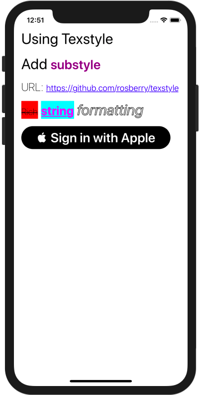

# Texstyle

[](https://travis-ci.org/rosberry/texstyle)
[](https://swift.org/)
[](https://github.com/Carthage/Carthage)
[](https://codecov.io/gh/rosberry/texstyle)

Texstyle allows you to format attributed strings easily.

## Features

- Applying attributes with strong typing and autocompletion
- Cache for attributes
- Substyles
- Convenient extensions for `String` and `UIButton`

## Requirements

- iOS 9.0+ / tvOS 9.0+
- Xcode 10.0+

## Usage

Here is a basic example of Texstyle using:

```swift
let text = Text(value: "Hello, World 🌍", style: .title1)
text.add(.heading1, for: "World")
titleLabel.attributedText = text.attributed
```

The result:


Let's start with text styles. There is a `TextStyle` class for configuring different style parameters like font, color, kerning etc. We prefer to use `TextStyle` extension for app specific styles:

```swift
extension TextStyle {

    static let title1: TextStyle = {
        let style = TextStyle()
        style.font = .systemFont(ofSize: 32, weight: .regular)
        return style
    }()
        
    static let heading1: TextStyle = {
        let style = TextStyle()
        style.font = .systemFont(ofSize: 28, weight: .semibold)
        style.color = .purple
        return style
    }()
}
```

It allows you to reuse the styles accross the app.

Next, create a `Text` instance. It contains string value and style:

```swift
let text = Text(value: "Hello, World 🌍", style: .title1)
```

Text also supports independent styles for each `UIControl.State`. For example, if you want to use a different style for button highlight state, you should initialize text like:

```swift
let text = Text(value: " Sign in with Apple", styles: [.normal: .heading1,
                                                         .highlighted: .heading2])
```

To create an attributed string, just use:

```swift
//By default for normal state
text.attributed

//For needed state
text.attributed(for: .highlighted)
```

All attributed strings are cached by default. It's useful in reusable elements like `UICollectionViewCell` or `UITableViewCell`.

There are convenience APIs for text creation and applying:

```swift
//String to text
"Settings".text(with: .heading1)

//UIButton
button.setText(text)
```

Check TexstyleExample project for more examples.



## Installation

#### Carthage
Create a `Cartfile` that lists the framework and run `carthage update`. Follow the [instructions](https://github.com/Carthage/Carthage#adding-frameworks-to-an-application) to add the framework to your project.

```
github "rosberry/Texstyle"
```

#### Manually

Drag `Sources` folder from [last release](https://github.com/rosberry/Texstyle/releases) into your project.

## About


This project is owned and maintained by [Rosberry](http://rosberry.com). We build mobile apps for users worldwide 🌏.

Check out our [open source projects](https://github.com/rosberry), read [our blog](https://medium.com/@Rosberry) or give us a high-five on 🐦 [@rosberryapps](http://twitter.com/RosberryApps).

## License

Texstyle is available under the MIT license. See the LICENSE file for more info.
